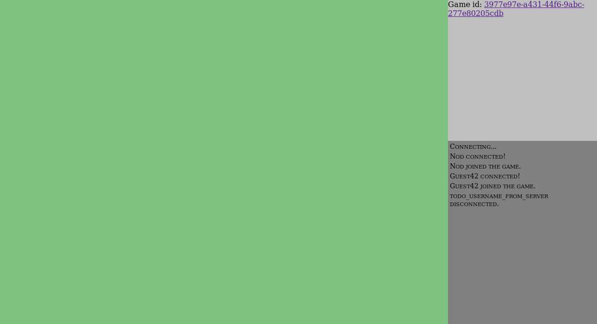

# tarot.rs - Work In Progress, dont expect too much

French tarot game built with Rust and WASM.

## Architecture

* tarot-lib: used by tarot-client and tarot-server. Contains Card, Player, Game, etc. Compiled as lib.
* tarot-client: web WASM app.
* tarot-server: executable.

The web site starts with standard HTTP requests, and the URL /game/play/ loads the WASM app.
From this point, tarot-client and tarot-server communicate over websockets.
